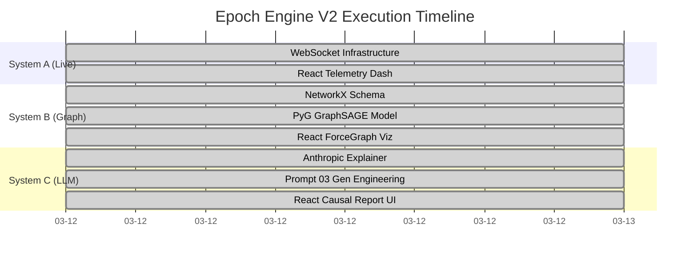

# EPOCH ENGINE — STRATEGIC ROADMAP

> Last updated: 2026-03-12 | Phase 10 Active

---

## What We Built Today (Session Recap)

### ✅ Priority 1: Modernized the Project Bible
`CLAUDE.md` was stuck at Phase 1 — only documenting `src/binary/`. Rewrote it to cover
all 8 source modules, 8 API endpoints, full data directory, and 9 completed phases.
Every future AI session now starts with accurate context.

### ✅ Priority 2: Enriched the State Logger
`state_logger.py` went from 25 lines / 6 fields to 105 lines / 14 fields.
The headless runner now computes **win probability, momentum, projected scores, and
scoring rates every tick** and logs them. Previously this data was computed and thrown away.

### ✅ Priority 3: Hardened Signal Alerts
`signal_alerts.py` went from prototype to production-ready:
- Fixed broken momentum detection logic
- Added per-alert-type cooldowns (60s / 90s / 120s) to prevent spam
- Introduced severity tiers: Tier 1 (critical), Tier 2 (notable), Tier 3 (info)
- Direction indicators (↑↓, → HOME / → AWAY)
- Projections only fire when the score actually changes

**Full test suite: 89 passed, 0 failed.**

---

## The Three Advanced Systems

These are the next three features that will make Epoch Engine untouchable.
They are ordered by implementation priority (A → B → C) because each
one feeds into the next.

---

### 🔥 System A: Live WebSocket Signal Dashboard

**Goal**: Real-time Bloomberg Terminal for NBA games.

**Why it matters**: This IS the product. The private beta's 50 users need to see
live signals updating in real time — not refreshing a page. This is what makes
them pay.

#### Architecture
```
headless_runner.py                 React Frontend
       │                                │
       ▼                                ▼
  StateLogger ──► FastAPI ──► WebSocket ──► D3.js Live Charts
       │              │
       ▼              ▼
  signal_alerts    /ws/game/{id}
  (enriched)       (push every tick)
```

#### Implementation Steps
1. **FastAPI WebSocket endpoint** (`/ws/game/{id}`)
   - Push enriched state (14 fields) per tick
   - Push signal alerts as they fire (with tier + direction)
   - Heartbeat every 5s when idle

2. **React Live Dashboard**
   - Win probability line chart (D3.js, updating in real time)
   - Momentum gauge (-100 to +100, color-coded)
   - Projected score display with trend arrows
   - Signal alert feed (toast notifications by tier)
   - Game clock + quarter display

3. **Signal History Panel**
   - Scrollable log of all alerts fired this game
   - Filter by tier (show only Tier 1 for noise reduction)
   - Click to see game state at moment of alert

#### New Files
```
src/api/websocket.py          — WebSocket manager + broadcast
src/frontend/src/pages/Live.jsx   — Live dashboard page
src/frontend/src/components/
  ├── WinProbChart.jsx        — D3.js real-time line chart
  ├── MomentumGauge.jsx       — Animated momentum meter
  ├── AlertFeed.jsx           — Tiered alert notification stream
  └── ProjectionDisplay.jsx   — Projected final score with trends
```

#### Dependencies
- `websockets` (Python)
- `d3` (npm)
- `recharts` or raw D3 for React integration

---

### 🧠 System B: Knowledge Graph + GNN Predictions

**Goal**: Every prediction backed by relationship intelligence.

**Why it matters**: This is the **moat**. Competitors use box scores and basic ML.
We encode the entire NBA as a graph — player relationships, coaching tendencies,
referee biases, arena effects — and run a GNN over it. The prediction becomes
"Curry's 3PT% drops 8% with Scott Foster crews at altitude" instead of "GSW 67%."

#### Architecture
```
nba_api + Basketball Reference
           │
           ▼
    Pipeline (daily ingestion)
           │
           ▼
    PostgreSQL + pgvector          NetworkX
    (persistent storage)     ◄──►  (in-memory graph)
           │                           │
           ▼                           ▼
    Node Feature Vectors          Edge Weights
           │                           │
           └──────────┬────────────────┘
                      ▼
              PyTorch Geometric (GNN)
                      │
                      ▼
              Win Probability V2
              (graph-aware predictions)
```

#### Node Types
| Node | Feature Vector | Example |
|------|---------------|---------|
| Player | 42 skills + 57 tendencies + age + fatigue + injury | Curry |
| Team | Win%, pace, ORtg, DRtg, recent form | Warriors |
| Coach | Timeout patterns, rotation depth, ATO efficiency | Kerr |
| Referee | Foul rate, home bias, travel call rate | Scott Foster |
| Arena | Altitude, court dimensions, crowd noise index | Chase Center |
| Game | Date, time, TV slot, rivalry flag, playoff flag | GSW vs LAL |

#### Edge Types
| Edge | Weight Formula | Updates |
|------|---------------|---------|
| PLAYS_FOR | Minutes share, usage rate | Daily |
| COACHED_BY | Years together, system fit score | Weekly |
| OFFICIATED_BY | Historical foul rate delta | Per game |
| PLAYS_AT | Home/away splits, altitude adjustment | Per game |
| MATCHUP | Head-to-head stats, positional advantage | Per game |

#### Implementation Steps
1. **Schema design** — PostgreSQL tables + NetworkX construction
2. **Daily pipeline** — Ingest nodes and edges from nba_api
3. **GNN model** — PyTorch Geometric, 2-layer GraphSAGE
4. **Integration** — GNN prediction → ensemble aggregator as vote #9
5. **Visualization** — D3.js force-directed graph on the dashboard

#### New Files
```
src/graph/
  ├── schema.py              — Node/Edge type definitions
  ├── builder.py             — NetworkX graph construction
  ├── features.py            — Feature vector extraction
  └── gnn_model.py           — PyTorch Geometric GraphSAGE
src/pipeline/
  └── graph_ingestion.py     — Daily graph update pipeline
```

#### Dependencies
- `torch`, `torch-geometric` (PyTorch Geometric)
- `networkx`
- `psycopg2` + `pgvector` (PostgreSQL)

---

### 🤖 System C: LLM Causal Chain Scouting Reports

**Goal**: Auto-generated "WHY" behind every prediction.

**Why it matters**: Numbers alone don't convince bettors. A 4-paragraph scouting
report that traces the **causal chain** from injury → matchup → simulation edge →
market divergence turns a probability into a conviction. This is the Tier 1
subscriber experience.

#### Architecture
```
Prediction Data (ensemble + signals + graph)
                    │
                    ▼
         Structured Prompt Builder
         (game context, injuries,
          fatigue, referee, momentum)
                    │
                    ▼
            Claude Opus 4.6 API
            (Prompt 03 from prompts.md)
                    │
                    ▼
         Causal Chain Scouting Report
         (4 paragraphs, 90-second read)
                    │
                    ▼
         /api/report/{game_id}
         (served to dashboard + email)
```

#### Report Structure
```
Paragraph 1: THE EDGE     — What the simulation sees that the market doesn't
Paragraph 2: THE MECHANISM — The causal chain (injury → matchup → advantage)
Paragraph 3: THE SIGNALS   — What confirms this (sharp money, ensemble, GNN)
Paragraph 4: THE RISKS     — Top 2 things that could invalidate the prediction
```

#### Implementation Steps
1. **Prompt builder** — Serialize prediction + signal + graph data into structured prompt
2. **LLM integration** — Claude API call with Prompt 03 template
3. **Report storage** — JSONL per game day, served via FastAPI
4. **Dashboard integration** — Expandable scouting report card per game
5. **Email pipeline** — Daily digest for Tier 1 subscribers

#### New Files
```
src/intelligence/
  ├── report_builder.py      — Structured prompt assembly
  └── causal_explainer.py    — Claude API integration + caching
src/api/
  └── reports.py             — /api/report/{game_id} endpoint
```

#### Dependencies
- `anthropic` (Claude API SDK)

---

## Implementation Order



> **Note**: Systems B and C can overlap — the LLM report builder can start
> once the graph schema is defined, even before the GNN is trained.

---

## The Competitive Moat

| What competitors do | What Epoch does |
|---|---|
| Box score regression | Full game simulation (Monte Carlo) |
| Single model predictions | 8-model ensemble + GNN (9th vote) |
| Static injury adjustments | Dynamic degradation matrix per body part × severity |
| No explanation | Causal chain scouting reports (LLM) |
| Batch updates | Real-time WebSocket signals with cooldowns + tiers |
| Flat player ratings | 42 skills + 57 tendencies from actual binary format |
| No referee modeling | Full referee crew bias profiling |
| No fatigue modeling | Rest days + travel + altitude + back-to-back tracking |

**Nobody else has the binary engine.** That's the foundation everything is built on.
